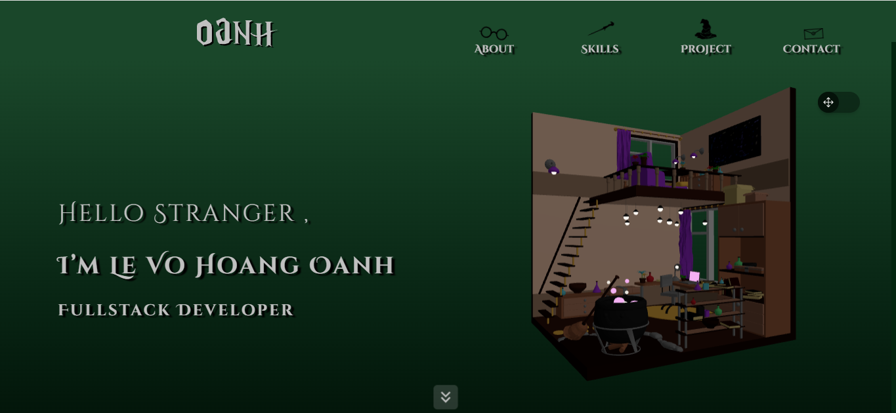

## 👋 Hi there! I'm Le Vo Hoang Oanh from Vietnam 🇻🇳

- 👩‍💻 I'm passionate about **coding**, **reading**, and **drawing**.
- 🌱 Currently learning **web development** with the goal of becoming a **Full-Stack Developer**.
- 🚀 Love exploring new technologies and building meaningful projects.
- 🎯 Always ready to learn and grow as a developer.

---

## 🌐 Portfolio

👉 Visit my portfolio: [https://oanhleportfolio.netlify.app/](https://oanhleportfolio.netlify.app/)

---

## 📬 Get in Touch

- 📧 Email: [levohoangoanh31102004@gmail.com](mailto:levohoangoanh31102004@gmail.com)  
- 💼 LinkedIn: [linkedin.com/in/levohoangoanh](https://www.linkedin.com/in/levohoangoanh/).
- 🌐 GitHub: [github.com/angsongji](https://github.com/angsongji).

<!---
angsongji/angsongji is a ✨ special ✨ repository because its `README.md` (this file) appears on your GitHub profile.
You can click the Preview link to take a look at your changes.
--->
